<!-- ════════ ANIMATED SYSTEM AWAKENING ════════ -->

 

<!-- ════════ STATUS + STATS + CIRCLE (animated SVG panels) ════════ -->
<table align="center" border="0">
<tr>
<td valign="middle"></td>
<td valign="middle"></td>
</tr>
</table>

---

## ⟦ ELEMENTAL AFFINITIES ⟧

> *"Most awaken with one element. The Monarch wields the full stack."*

---

<!-- ════════ ANIMATED RAID TIMELINE ════════ -->

---

## ⟦ SHADOW ARMY ⟧ — *Repositories I Have Risen*

> **"ARISE."**

---

## ⟦ MONARCH'S POWER METRICS ⟧

  

---

## ⟦ MANA FLOW ⟧ — *Contribution Aura*

---

<!-- ════════ ANIMATED SKILL TREE ════════ -->

---

## ⟦ SUMMON THE MONARCH ⟧

 

 

